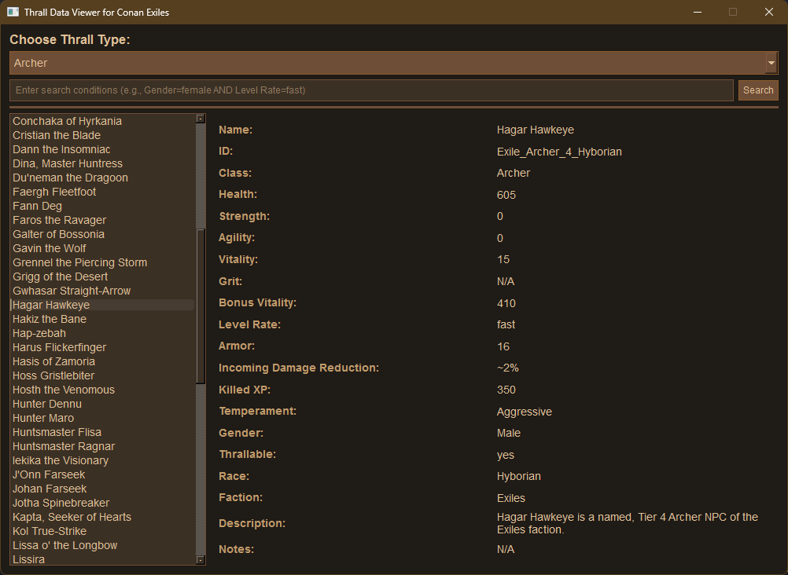

# Thrall Data Viewer for Conan Exiles

This is a desktop application for viewing and searching thrall data from the game *Conan Exiles*. It utilizes an SQLite database and a PySide6 graphical user interface (GUI) to provide an intuitive way to explore and analyze thrall details. The formatted text data is included. Data was extracted from the official [Conan Exiles Wiki](https://conanexiles.fandom.com/wiki/Conan_Exiles_Wiki). Included is the populate_db.py file used to put the data into the thralls.db database. Other scripts were written and used to strip and format the useable data from the text files extracted from the Wiki. If anyone wants them, let me know.

## Features

- Dropdown selection for thrall types.
- Search functionality with support for multiple conditions.
- Detailed view of thrall attributes, including stats and descriptions.
- Intuitive and customizable GUI with a Conan Exiles-themed design.

## Requirements

- Python 3.11 or later
- SQLite database (`thralls.db`)
- PySide6 library

## Installation

1. Clone this repository:
   ```bash
   git clone <repository-url>
   cd <repository-folder>
   ```

2. Install the required Python libraries:
   ```bash
   pip install PySide6
   ```

3. Ensure the SQLite database (`thralls.db`) is in the same directory as `thralls.py`.

## Usage

1. Run the application:
   ```bash
   python thralls.py
   ```

2. Use the dropdown menu to select a thrall type and browse the database.

3. Enter search conditions (e.g., `Gender=female AND Level Rate=fast`) to filter results.

## Screenshot



## License

This project is licensed under the [MIT License](https://opensource.org/licenses/MIT).

---

